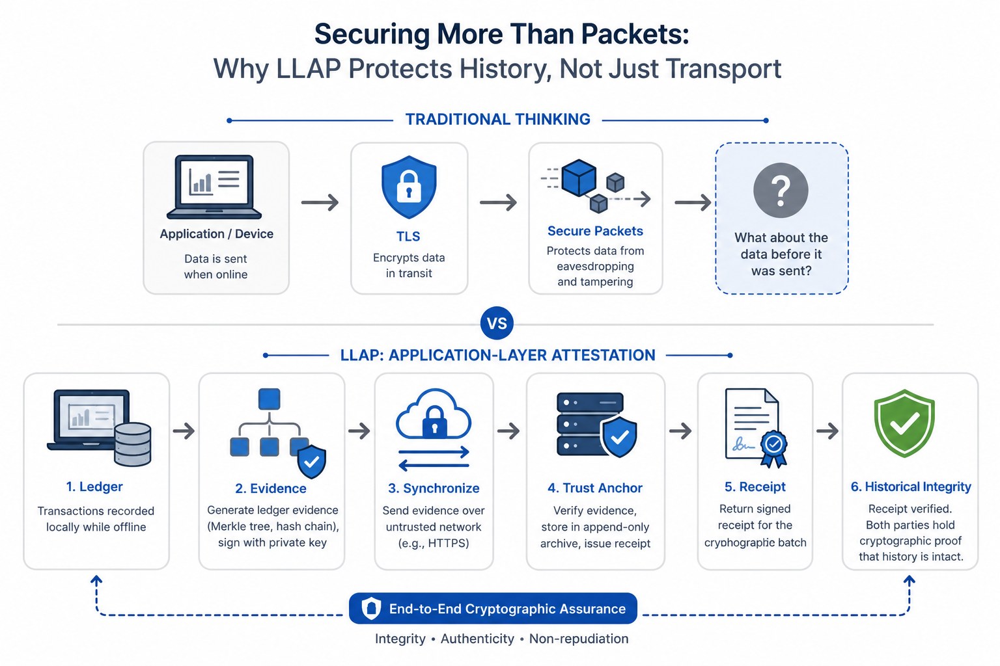

# Lightweight Ledger Attestation Protocol (LLAP)

> **A protocol proposal for cryptographically attesting offline-generated transaction history before synchronization.**

[](#)
[](#)
[](LICENSE)


---

## Status

**Research Proposal (Draft v0.1)**

LLAP is an active research and engineering project exploring application-layer attestation for offline-first enterprise systems.

The protocol is currently under development and **should not yet be considered production-ready**.

---

# Why LLAP?

Offline-first systems are increasingly operating for extended periods without reliable network connectivity.

While **Transport Layer Security (TLS)** protects data during transmission, it cannot answer an equally important question:

> **How do we know offline-generated transaction history wasn't modified before synchronization even began?**

LLAP addresses this problem by introducing **application-layer cryptographic attestation**.

In short:

- TLS secures communication.
- LLAP attests history.

<p align="center">
  
</p>

---

# Overview

Offline-first architectures are becoming increasingly common across enterprise environments, including:

- Retail Point-of-Sale (POS)
- Manufacturing
- Industrial IoT
- Logistics
- Mining
- Maritime Systems
- Edge Computing
- Remote Field Operations

These systems continue operating while disconnected from central infrastructure.

When connectivity returns, synchronization typically occurs over HTTPS with digitally signed requests.

Although secure during transmission, traditional synchronization provides little evidence that the locally stored transaction history remained intact throughout the offline period.

LLAP introduces an additional verification layer before synchronized data is accepted.

---

# The Problem

Imagine a retail store operating without internet connectivity for three days.

During that time:

- Customers continue making purchases.
- Inventory is updated.
- Payments are recorded.
- Thousands of transactions accumulate locally.

When connectivity returns:

- Every request is transmitted over HTTPS.
- Every request is digitally signed.
- Every packet is protected by TLS.

Everything appears secure.

Yet one question remains unanswered:

> **Was the local transaction history rewritten before synchronization?**

Traditional transport security cannot answer this question because it protects communication—not historical integrity.

---

# What is LLAP?

The **Lightweight Ledger Attestation Protocol (LLAP)** is a protocol proposal for cryptographically attesting offline-generated transaction history before synchronization.

Rather than treating synchronization as a networking task, LLAP treats synchronization as an **attestation process**.

Before accepting synchronized data, the Trust Anchor verifies cryptographic evidence that the submitted ledger history has remained consistent.

LLAP complements existing technologies rather than replacing them.

Examples include:

- TLS
- Digital Signatures
- Merkle Trees
- Distributed Databases
- Consensus Protocols

---

# High-Level Workflow

<p align="center">
  
</p>

<p align="center">
<b>Figure 1.</b> High-level workflow of the Lightweight Ledger Attestation Protocol (LLAP).
</p>


---

# Design Principles

LLAP is designed around several core principles.

- Deterministic
- Lightweight
- Verifiable
- Transport Agnostic
- Cryptographically Composable
- Vendor Neutral

The protocol intentionally composes existing cryptographic primitives instead of introducing new ones.

---

# Core Components

LLAP combines established cryptographic techniques into a deterministic workflow.

- Historical Hash Chaining
- Merkle Trees
- Canonical Serialization (CBOR)
- Digital Signatures (Ed25519 / ECDSA)
- Append-only Archives
- Idempotency Keys
- Signed Cryptographic Receipts

The contribution lies in **protocol composition**, not in inventing new cryptography.

---

# Security Goals

LLAP aims to provide:

- Historical Integrity
- Tamper Detection
- Replay Protection
- Non-repudiation
- Verifiable Synchronization
- Cryptographic Receipts
- Deterministic Evidence Generation
- Historical Continuity

---

# Non-Goals

LLAP intentionally does **not** attempt to solve:

- Endpoint malware
- Physical device compromise
- Private key theft
- Byzantine Fault Tolerance
- Distributed consensus
- Confidentiality without TLS

These concerns require complementary security mechanisms.

---

# LLAP vs Traditional Synchronization

| Traditional Synchronization | LLAP |
|-----------------------------|------|
| TLS | TLS + Ledger Evidence |
| HTTP 200 OK | Signed Cryptographic Receipt |
| Local database implicitly trusted | Local history cryptographically verified |
| Blind retry after timeout | Idempotent recovery |
| No historical proof | Historical attestation |
| Limited replay protection | Idempotency keys |
| No tamper evidence | Historical hash chain |

---

# Frequently Asked Questions

## Is LLAP a blockchain?

No.

LLAP does not establish decentralized consensus.

Instead, LLAP assumes the existence of a trusted authority (Trust Anchor) and focuses on proving that offline-generated history has not been rewritten before synchronization.

Consensus and attestation solve different trust problems.

---

## Does LLAP replace TLS?

No.

TLS remains essential for securing communication.

LLAP complements TLS by protecting a different layer: **historical integrity**.

---

## Does LLAP invent new cryptography?

No.

LLAP combines existing technologies including:

- CBOR
- Merkle Trees
- Hash Chaining
- Digital Signatures
- Signed Receipts

into a deterministic protocol workflow.

---

# Repository Structure

```
LLAP/
├── README.md
├── SPECIFICATION.md
├── docs/
├── diagrams/
├── examples/
├── test-vectors/
├── reference/
└── papers/
```

---

# Documentation

| Document | Description |
|----------|-------------|
| SPECIFICATION.md | Official protocol specification |
| docs/architecture.md | System architecture |
| docs/protocol-overview.md | Protocol overview |
| docs/threat-model.md | Threat model |
| docs/security-analysis.md | Security analysis |
| docs/state-machine.md | State machine |
| docs/message-format.md | Message definitions |
| docs/cryptography.md | Cryptographic components |

---

# Whitepaper

The original whitepaper is available in:

```
papers/LLAP_Whitepaper.pdf
```

The introductory article is available on Medium.

---

# Reference Implementations

| Language | Status |
|----------|--------|
| Python | Planned |
| Go | Planned |

Reference implementations are intended for interoperability testing and educational purposes.

---

# Project Status

| Component | Status |
|------------|--------|
| Whitepaper | ✅ |
| Protocol Specification | ✅ |
| Workflow Diagrams | ✅ |
| Threat Model | 🚧 |
| Security Analysis | 🚧 |
| Test Vectors | 🚧 |
| Python Reference | 🚧 |
| Go Reference | 🚧 |
| Formal Verification | Planned |

---

# Roadmap

## v0.1

- Whitepaper
- Initial Specification
- Workflow Diagrams

## v0.2

- Threat Model
- State Machine
- Test Vectors
- Message Formats

## v0.3

- Python Reference Implementation
- Go Reference Implementation

## v0.5

- Security Review
- Performance Benchmark
- Hardware-backed Key Integration

## v1.0

- Stable Protocol Specification
- Community Review
- Production-ready SDKs

---

# References

The protocol builds upon well-established standards and technologies.

- RFC 8949 — CBOR
- RFC 8032 — Ed25519
- RFC 9162 — Certificate Transparency
- NIST FIPS 180-4 (SHA-2)
- Google Android Offline-first Architecture
- Microsoft Azure IoT Edge

---

# Vision

The long-term vision of LLAP is to become an open, vendor-neutral protocol for application-layer attestation in offline-first enterprise systems.

The project aims to be:

- Open
- Vendor Neutral
- Language Independent
- Easily Implementable
- Suitable for Enterprise and Edge Computing

---

# Contributing

Contributions are welcome.

Areas of interest include:

- Distributed Systems
- Applied Cryptography
- Offline-first Architecture
- Edge Computing
- Threat Modeling
- Formal Verification
- Reference Implementations
- Performance Benchmarking

Please open an Issue before submitting major changes.

---

# License

This repository is licensed under the **Apache License 2.0**.

See the `LICENSE` file for details.

---

# Citation

If you reference LLAP in academic work or technical publications, please cite the project repository or the accompanying whitepaper.

Support for **CITATION.cff** and **BibTeX** will be added in a future release.

---

# Author

**Bambang Irawan**

Software Developer

Areas of interest:

- Distributed Systems
- Cybersecurity
- Enterprise Architecture
- Artificial Intelligence
- Edge Computing
- Offline-first Systems

LLAP is an ongoing research and engineering project.

Constructive feedback, technical discussion, and collaboration are welcome.
